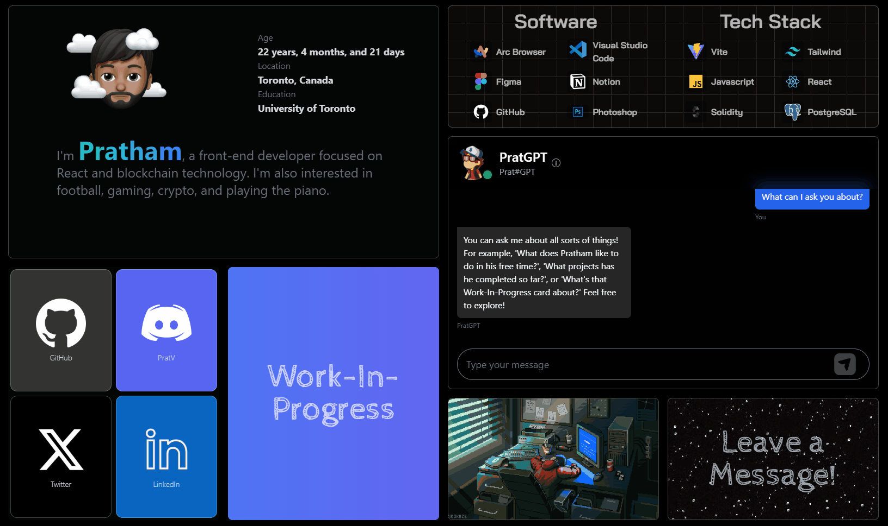

# Developer Portfolio Website



🌐 [Visit My Portfolio](https://prathamvijh.com/)

Welcome to the source code of my personal portfolio! 🎉 This is where I showcase my skills, interests, and projects. It's a constantly evolving project, and I'm excited to share how my skills improve over time. Feel free to explore, learn, and contribute!

[Back to top](#prathams-personal-portfolio-)

---

## Built With

- **Vite**
- **React.js**
- **Tailwind CSS**
- **Node.js**

---

## 🛠️ Getting Started

If you'd like to use this portfolio as a template or explore its features, here’s how you can get started:

### Clone the Repository

```bash
git clone https://github.com/Pratv77/My-Portfolio.git
```
### Prerequisites
Ensure you have Node.js and a package manager like **npm** installed.

### Installation
1. Navigate to the project directory:
```bash
cd portfolio
```
2. Install the necessary dependencies:
```bash
npm i
```
3. Start the development server:
```bash
npm run dev
```
4. Open http://localhost:3000 in your browser to view the site. You can edit files in the src/ folder, and changes will automatically reflect as you work.

## 🚀 Features
- Fully responsive design for all devices
- Smooth animations and engaging UI
- Interactive chatbot powered by OpenAI Assistant API
- Dynamic display of skills, tools, and work-in-progress card designated to future main project
- A "Leave a Message!" card for visitor feedback

## License

This project is licensed under a custom MIT License. See the [LICENSE.txt](./LICENSE.txt) file for details on usage and attribution.

